# 5 test cases + o tentando ir mais longe (talvez do fundo do poço)
by: Eduardo Oliveira 
for:Hayashi 🫰

## Test cases parte 1 da ponderada :
1. **Inserir Produto**: Teste para verificar se um produto pode ser inserido na tabela hash corretamente.

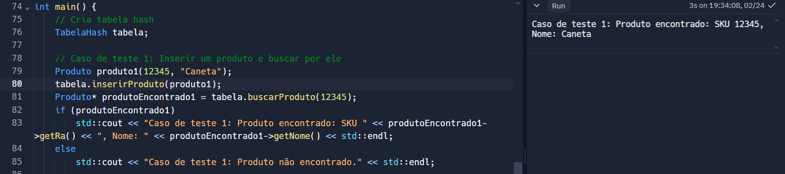

Eita que foi sucesso 
   
2. **Inserir dois produtos com o mesmo SKU**: Intenção de analisar qual produto sera escolhido tendo o mesmo SKU.
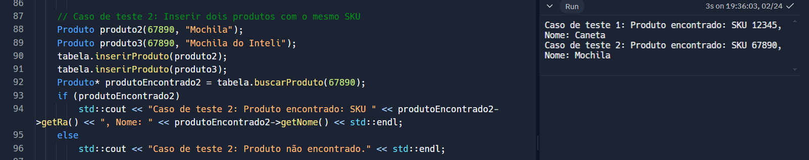

Foi o primeiro eita gloria.

3. **Buscar Produto Inexistente**: Teste para verificar o comportamento quando tentamos buscar um produto que não está presente na tabela hash.
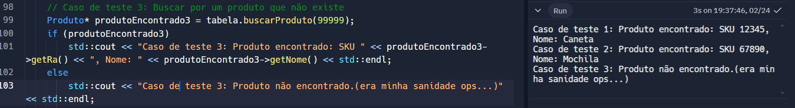

 Nessa outra imagem busquei por um produto já existente, só para testar de novo se tava tudo okay.

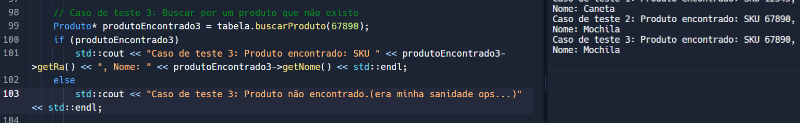

Estava tudo okay, ta vendo que lindo Hayashi ? 

4. **Colisões**: Teste para verificar como a tabela hash lida com colisões, ou seja, quando dois produtos têm o mesmo valor de hash.

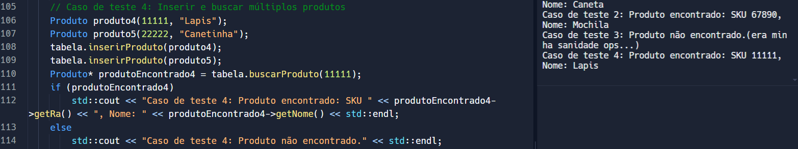

E ele foi encontrado !!! Viva ao lapis

5. **Remover Produto**: Teste para verificar se um produto pode ser removido corretamente da tabela hash.

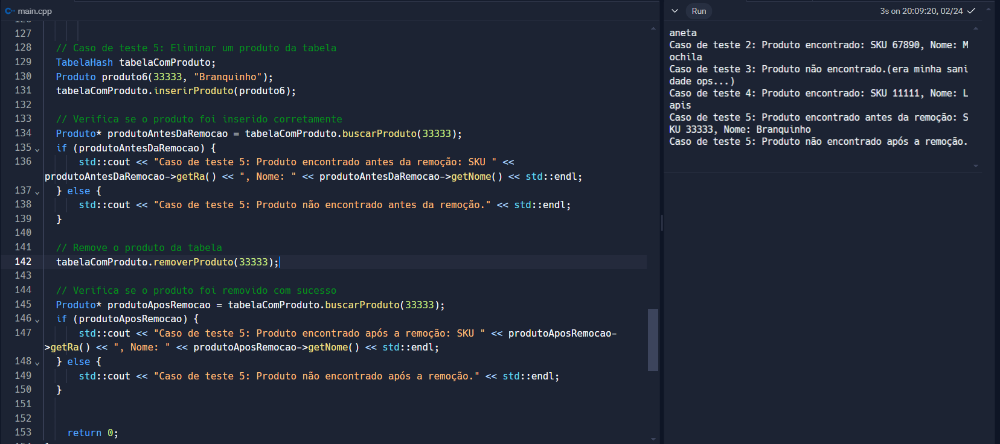

Olha lá, hheeheheheh FOIIIIIII

---
## Parte 2 (não esperava que fosse legal assim )
Claro! Aqui está o texto revisado:

---

Para realizar esta parte em Solidity, utilizei o ChatGPT como apoio para conseguir elaborar o contrato e aprender passo a passo como utilizar a plataforma Remix.

Antes de começar, já tinha minha carteira MetaMask conectada à minha conta com meu dinheiro fictício.

Após isso, criei o documento onde inseri o código do contrato. Em seguida, naveguei até a seção SOLIDITY COMPILER e selecionei a versão que estava seguindo.

**Passo a Passo:**

1. **Preparação:**
    - Acessei a plataforma Remix Ethereum e garanti que minha carteira MetaMask estava conectada.

2. **Criação do Contrato:**
    - Criei um novo documento no Remix e inseri o código do contrato `ProdutoContract`.

3. **Compilação e Implantação:**
    - Compilei o contrato na seção "SOLIDITY COMPILER" e selecionei a versão apropriada do Solidity.
    - Em seguida, implantei o contrato na seção "DEPLOY & RUN TRANSACTIONS" e confirmei a transação na MetaMask.

    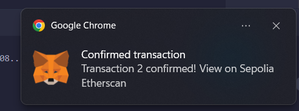

4. **Inserção de Dados:**
    - Após o deploy, inseri os dados testando o contrato, adicionando um produto com SKU e valor.

    

5. **Confirmação da Transação:**
    - Confirmei a transação na MetaMask.

    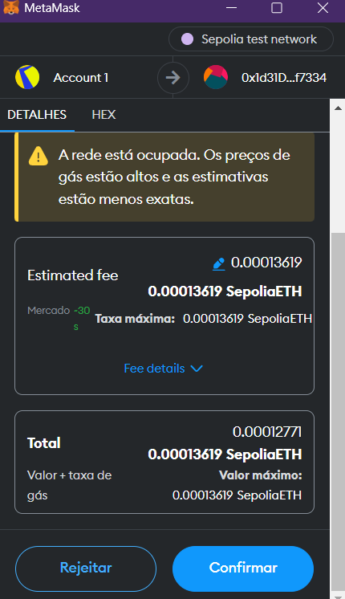

6. **Verificação da Informação:**
    - Acompanhei a execução do contrato no terminal, aguardando o carregamento.

    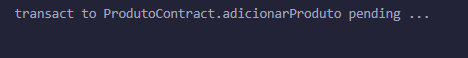
    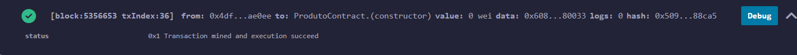

7. **Teste de Chamada por SKU:**
    - Realizei o teste de chamada por SKU no contrato.

    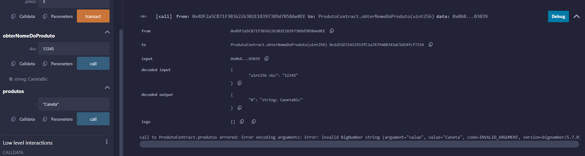

8. **Teste de Chamada por Produto:**
    - Realizei o teste de chamada por produto no contrato.

    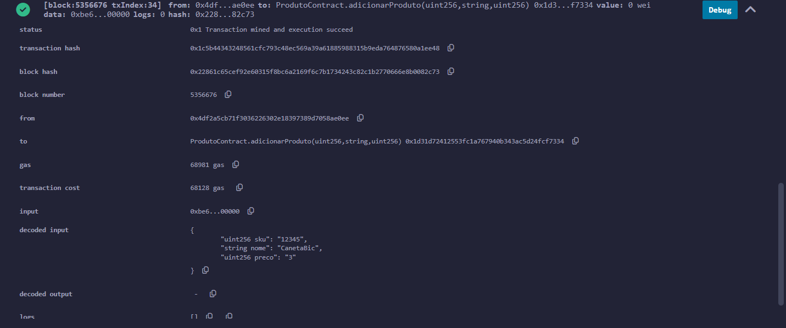

 Todas as interações com o contrato foram realizadas ebaaaaa ✨✨✨✨😭😭🫶🫡🫰.

---
 
please 
PLEASEEEE, to quase chorando pela nota 

be gentle 

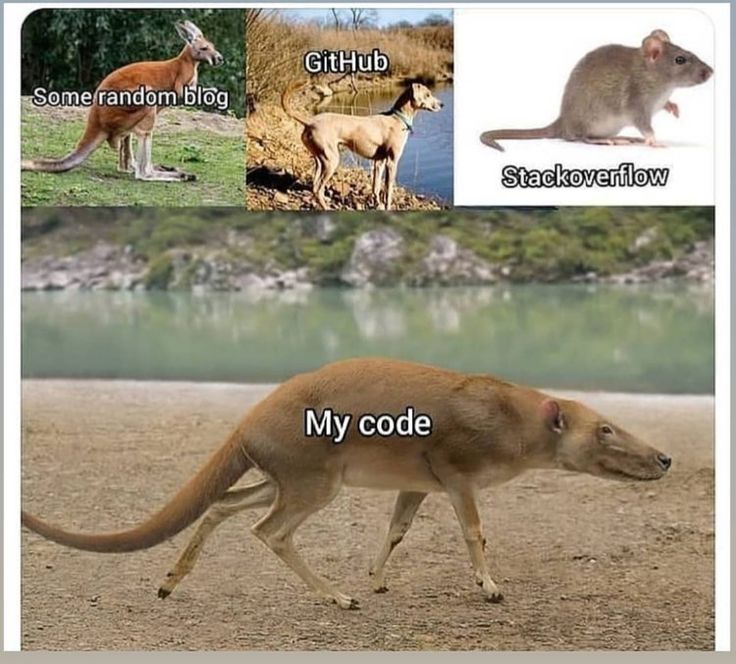

